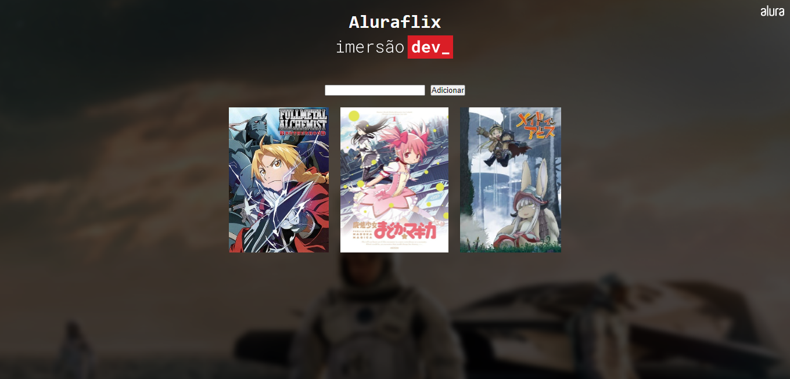

<h1 align="center">Projetos da Imersão Dev</h1>

## Descrição
Projetos feitos durante a Imersão Dev - 3 edição.

#

    
    
    

#

# Layout

## VARIÁVEIS, OPERAÇÕES E MÉDIA

#

## CONVERSOR DE	MOEDAS

#

## MENTALISTA

#

## ARRAY, LISTA E ALURAFLIX

#

## FUNÇÕES NO ALURAFLIX

#

## OBJETOS E TABELAS DE CLASSIFICAÇÃO

#

## SUPER TRUNFO	- LÓGICA DO JOGO

#

## SUPER TRUNFO: MONTAGEM DAS CARTAS

#

## FIGMA, HTML E CSS

#

## PORTFÓLIO

